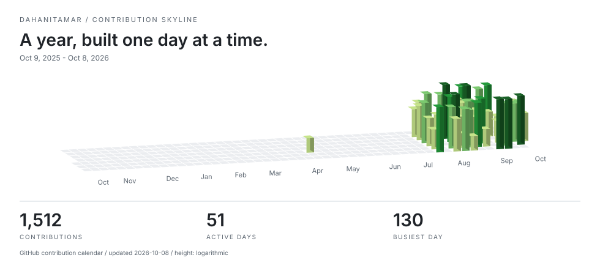

# Itamar Dahan

**Full-stack & automation developer · Israel**

I build useful systems. Then make them dependable.

[Website](https://itamardahan.com/) · [Projects](#selected-work) · [Open-source contributions](https://github.com/pulls?q=is%3Apr+author%3ADahanItamar+is%3Amerged)

<picture>
  <source media="(prefers-color-scheme: dark)" srcset="assets/skyline/dark.svg" />
  
</picture>

### Selected work

- **[Slotline](https://github.com/DahanItamar/Slotline)** — Multi-tenant booking with PostgreSQL constraints that prevent double-booking, row-level tenant isolation, and live calendars.
- **[Winnow](https://github.com/DahanItamar/Winnow)** — A local-first desktop tool that turns developer complaints into project ideas linked to their original sources.
- **[House Rules](https://github.com/DahanItamar/HouseRules)** — An offline Godot casino adventure and an experiment in AI-assisted game development.

### How I build

TypeScript, React, Node.js, C#/.NET, PostgreSQL, SQLite, Docker, and n8n. Readable architecture, secure defaults, and accessible interfaces.

### Open source

Merged contributions to **mise**: [#13985](https://github.com/jdx/mise/pull/13985) · [#14034](https://github.com/jdx/mise/pull/14034).

The skyline uses GitHub's contribution calendar and refreshes daily. Open my [GitHub activity](https://github.com/DahanItamar?tab=overview) for individual days.
