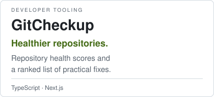

<h1 align="center">ITAMAR DAHAN</h1>

<strong>Full-stack development · Automation · AI-assisted engineering</strong>

<h2 align="center">I build useful systems. Then make them dependable.</h2>

  <a href="#selected-systems">Selected systems</a> · <a href="#how-i-build">How I build</a> · <a href="mailto:itamardahan1111d@gmail.com">Start a conversation</a>

<strong>Readable architecture. Secure defaults. Accessible interfaces.</strong>

<strong>Development</strong>

  <picture><source media="(prefers-color-scheme: dark)" srcset="assets/components/badges/typescript.svg" /></picture>
  <picture><source media="(prefers-color-scheme: dark)" srcset="assets/components/badges/javascript.svg" /></picture>
  <picture><source media="(prefers-color-scheme: dark)" srcset="assets/components/badges/react.svg" /></picture>
  <picture><source media="(prefers-color-scheme: dark)" srcset="assets/components/badges/nodedotjs.svg" /></picture>
  <picture><source media="(prefers-color-scheme: dark)" srcset="assets/components/badges/csharp.svg" /></picture>

  <picture><source media="(prefers-color-scheme: dark)" srcset="assets/components/badges/dotnet.svg" /></picture>
  <picture><source media="(prefers-color-scheme: dark)" srcset="assets/components/badges/postgresql.svg" /></picture>
  <picture><source media="(prefers-color-scheme: dark)" srcset="assets/components/badges/sqlite.svg" /></picture>
  <picture><source media="(prefers-color-scheme: dark)" srcset="assets/components/badges/docker.svg" /></picture>
  <picture><source media="(prefers-color-scheme: dark)" srcset="assets/components/badges/git.svg" /></picture>

<strong>AI &amp; automation</strong>

  <picture><source media="(prefers-color-scheme: dark)" srcset="assets/components/badges/claudecode.svg" /></picture>
  <picture><source media="(prefers-color-scheme: dark)" srcset="assets/components/badges/codex.svg" /></picture>
  <picture><source media="(prefers-color-scheme: dark)" srcset="assets/components/badges/gemini.svg" /></picture>
  <picture><source media="(prefers-color-scheme: dark)" srcset="assets/components/badges/n8n.svg" /></picture>

## Selected systems

  <a href="https://github.com/DahanItamar/DockNest"><picture><source media="(prefers-color-scheme: dark)" srcset="assets/components/docknest-card.svg" /></picture></a>
  <a href="https://github.com/DahanItamar/Slotline"><picture><source media="(prefers-color-scheme: dark)" srcset="assets/components/slotline-card.svg" /></picture></a>

  <a href="https://github.com/DahanItamar/Winnow"><picture><source media="(prefers-color-scheme: dark)" srcset="assets/components/winnow-card.svg" /></picture></a>
  <a href="https://github.com/DahanItamar/HouseRules"><picture><source media="(prefers-color-scheme: dark)" srcset="assets/components/houserules-card.svg" /></picture></a>

  <a href="https://github.com/DahanItamar/GitCheckup"><picture><source media="(prefers-color-scheme: dark)" srcset="assets/components/gitcheckup-card.svg" /></picture></a>

## How I build

<picture>
  <source media="(max-width: 640px) and (prefers-reduced-motion: reduce)" srcset="assets/components/process-mobile-still.svg" />
  <source media="(prefers-reduced-motion: reduce)" srcset="assets/components/process-still.svg" />
  <source media="(max-width: 640px)" srcset="assets/components/process-mobile.svg" />
  
</picture>

I turn engineering workflows into reusable skills for AI coding agents:

- [**spec-architect**](https://github.com/DahanItamar/spec-architect) — six stages with stable, verified acceptance criteria.
- [**readme-architect**](https://github.com/DahanItamar/readme-architect) — documentation grounded in running the project.
- [**uilint**](https://github.com/DahanItamar/uilint) — checks loading, empty, error, success and partial interface states.
- [**acsm**](https://github.com/DahanItamar/acsm) — routes projects to applicable security and compliance obligations, with citations.

## Contribution activity

<picture>
  <source media="(prefers-color-scheme: dark)" srcset="https://raw.githubusercontent.com/DahanItamar/DahanItamar/output/pacman-contribution-graph-dark.svg" />
  
</picture>

<strong>Also built</strong> · games, live tools, web platforms and automation

 

| Project | What it does | Stack |
|:--|:--|:--|
| [**House Rules**](https://github.com/DahanItamar/HouseRules) | An offline casino adventure with nine playable cabinets and four connected rooms, built as a human-directed, AI-assisted game-development experiment. | <samp>Godot 4 · GDScript</samp> |
| [**GitCheckup**](https://github.com/DahanItamar/GitCheckup) | Scores public repositories across docs, community, activity, popularity and hygiene, with a ranked list of fixes. | <samp>TypeScript · Next.js</samp> |
| [**HeWordle**](https://github.com/DahanItamar/HeWordle) | Daily Hebrew Wordle with accounts, streaks and a leaderboard; zero npm dependencies and encrypted answers. | <samp>Node.js · SQLite</samp> |
| [**Meridian**](https://github.com/DahanItamar/meridian-landing) | A bilingual EN/HE landing page for a premium espresso grinder, with RTL support and a spec-driven accessibility process. [Visit](https://meridian.itamardahan.com/). | <samp>TypeScript · Next.js · Tailwind</samp> |
| [**Dealership Platform**](https://github.com/DahanItamar/dealership-platform) | A white-label bilingual car-dealership platform: showroom, financing, leads and an admin back office, with an in-memory demo mode. | <samp>TypeScript · TanStack · Supabase</samp> |
| [**Airport Simulator**](https://github.com/DahanItamar/AirportSimulator) | Real-time airport simulation with arrivals, departures and shared runway/gate queues, visible in a zero-dependency control-tower UI. | <samp>C# · ASP.NET Core · JS</samp> |
| [**ShortLinks**](https://github.com/DahanItamar/ShortLinks-Project) | URL shortener with Google sign-in, per-user analytics, ownership-guarded logs and cryptographically generated short codes. | <samp>C# · ASP.NET Core · EF Core</samp> |
| [**Warehouse Serial Scanner**](https://github.com/DahanItamar/warehouse-serial-scanner) | Touchscreen warehouse intake: barcode scanning, keypad checkout and pluggable SQL Server, MySQL or Postgres storage, plus a mock mode. | <samp>Node.js · Express</samp> |
| **Smart Data Matcher** | AI-powered spreadsheet normalization, LLM column mapping, value cleanup and rule-based filtering. | <samp>TypeScript · Gemini · Supabase</samp> |
| **Market News Engine** | An autonomous market-news pipeline producing and publishing posts, stories and short-form video across social platforms. | <samp>n8n · LLM APIs · Social APIs</samp> |
| **TeachersPlatform** | A Hebrew-first music-teacher marketplace with service listings, faceted search and escrow-protected payments. | <samp>TypeScript · Next.js · Prisma</samp> |
| **Shift Harmony** | Team shift planning and scheduling through a component-driven interface. | <samp>React · TypeScript · Cloudflare</samp> |
| **PulseOps** | A self-hosted real-time operations console for a single Docker engine. | <samp>TypeScript</samp> |

<strong>About and engineering principles</strong>

I build applications end to end: server, data and interface. My work spans developer tooling, desktop software, scheduling systems, games and intelligent automation. I care about what happens after the first successful demo: readable architecture, secure defaults, accessible interfaces and a clear path to maintaining the system.

AI is part of both the engineering process and the products I build. I work with Claude Code, Codex and LLM-assisted workflows for architecture, implementation, review and testing; I also build automations with n8n and LLM APIs that connect services and turn repeated manual work into dependable processes.

<strong>Engineering principles and stack</strong>

 

- **Architecture first:** small classes, clear layers and code that explains itself.
- **Fewer dependencies:** fewer moving parts and a smaller maintenance surface.
- **Security by default:** encryption at rest, proper password hashing and secrets kept out of Git.
- **Accessible interfaces:** keyboard and screen-reader support, with WCAG guiding implementation.

**Core:** JavaScript · TypeScript · React · Node.js · C# · .NET · PostgreSQL · SQLite · Docker

**AI and automation:** Claude Code · Codex · n8n · LLM APIs · agent workflows

---

**Explore the work. Start a conversation.**

[itamardahan1111d@gmail.com](mailto:itamardahan1111d@gmail.com)
