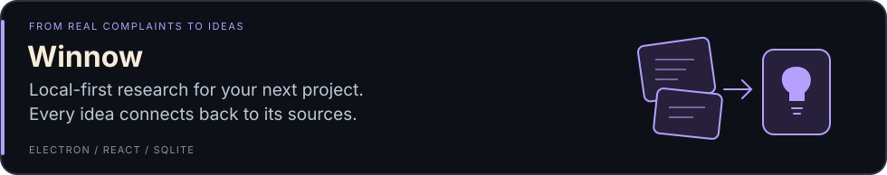
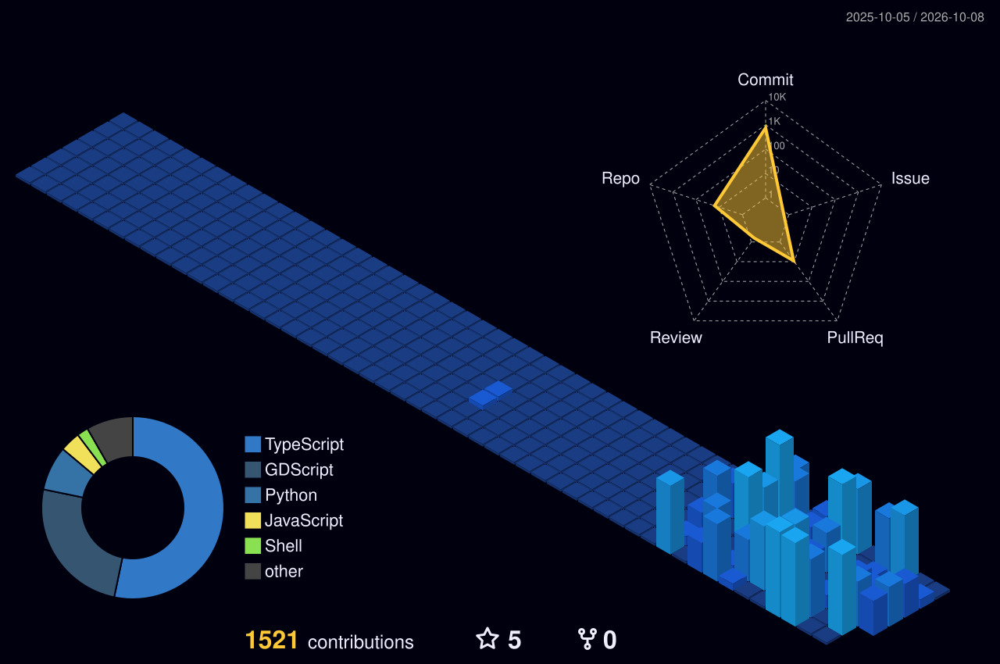

<p align="center">
  <a href="https://itamardahan.com/"><strong>My website ↗</strong></a>
  &nbsp; · &nbsp;
  <a href="#things-ive-built">Things I've built</a>
  &nbsp; · &nbsp;
  <a href="#a-year-in-3d">A year in 3D</a>
</p>

### A little about me 👋

```typescript
const itamar = {
  basedIn: "Israel",
  builds: ["full-stack apps", "automation", "desktop tools"],
  worksWith: ["TypeScript", "React", "Node.js", "C# / .NET"],
  caresAbout: ["readable architecture", "secure defaults", "accessible UI"],
};
```

### Things I've built

<a href="https://github.com/DahanItamar/Slotline"></a>

<a href="https://github.com/DahanItamar/Winnow"></a>

<a href="https://github.com/DahanItamar/HouseRules"></a>

### Out in the open

Recent open-source work includes two merged contributions to **mise**: [#13985](https://github.com/jdx/mise/pull/13985) · [#14034](https://github.com/jdx/mise/pull/14034).

[More merged contributions ↗](https://github.com/pulls?q=is%3Apr+author%3ADahanItamar+is%3Amerged)

### A year in 3D



<sub>Built from my GitHub activity and refreshed daily with [github-profile-3d-contrib](https://github.com/yoshi389111/github-profile-3d-contrib). [Explore my activity ↗](https://github.com/DahanItamar?tab=overview)</sub>
