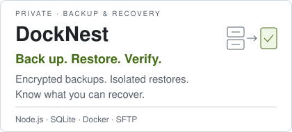
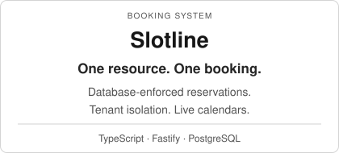
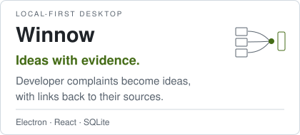
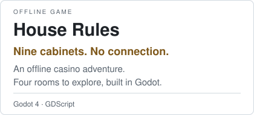

<h1 align="center">ITAMAR DAHAN</h1>

<strong>Full-stack development · Automation · AI-assisted engineering</strong>

<h2 align="center">I build useful systems. Then make them dependable.</h2>

  <a href="#selected-systems">Selected systems</a> · <a href="#how-i-build">How I build</a> · <a href="mailto:itamardahan1111d@gmail.com">Start a conversation</a>

<strong>Readable architecture. Secure defaults. Accessible interfaces.</strong>

<strong>Development</strong>

  <picture><source media="(prefers-color-scheme: dark)" srcset="assets/components/badges/typescript.svg" /></picture>
  <picture><source media="(prefers-color-scheme: dark)" srcset="assets/components/badges/javascript.svg" /></picture>
  <picture><source media="(prefers-color-scheme: dark)" srcset="assets/components/badges/react.svg" /></picture>
  <picture><source media="(prefers-color-scheme: dark)" srcset="assets/components/badges/nodedotjs.svg" /></picture>
  <picture><source media="(prefers-color-scheme: dark)" srcset="assets/components/badges/csharp.svg" /></picture>

  <picture><source media="(prefers-color-scheme: dark)" srcset="assets/components/badges/dotnet.svg" /></picture>
  <picture><source media="(prefers-color-scheme: dark)" srcset="assets/components/badges/postgresql.svg" /></picture>
  <picture><source media="(prefers-color-scheme: dark)" srcset="assets/components/badges/sqlite.svg" /></picture>
  <picture><source media="(prefers-color-scheme: dark)" srcset="assets/components/badges/docker.svg" /></picture>
  <picture><source media="(prefers-color-scheme: dark)" srcset="assets/components/badges/git.svg" /></picture>

<strong>AI &amp; automation</strong>

  <picture><source media="(prefers-color-scheme: dark)" srcset="assets/components/badges/claudecode.svg" /></picture>
  <picture><source media="(prefers-color-scheme: dark)" srcset="assets/components/badges/codex.svg" /></picture>
  <picture><source media="(prefers-color-scheme: dark)" srcset="assets/components/badges/gemini.svg" /></picture>
  <picture><source media="(prefers-color-scheme: dark)" srcset="assets/components/badges/n8n.svg" /></picture>

## Selected systems

  <a href="https://github.com/DahanItamar/DockNest"><picture><source media="(prefers-color-scheme: dark)" srcset="assets/components/docknest-card.svg" /></picture></a>
  <a href="https://github.com/DahanItamar/Slotline"><picture><source media="(prefers-color-scheme: dark)" srcset="assets/components/slotline-card.svg" /></picture></a>

  <a href="https://github.com/DahanItamar/Winnow"><picture><source media="(prefers-color-scheme: dark)" srcset="assets/components/winnow-card.svg" /></picture></a>
  <a href="https://github.com/DahanItamar/HouseRules"><picture><source media="(prefers-color-scheme: dark)" srcset="assets/components/houserules-card.svg" /></picture></a>

## How I build

<picture>
  <source media="(max-width: 640px) and (prefers-reduced-motion: reduce)" srcset="assets/components/process-mobile-still.svg" />
  <source media="(prefers-reduced-motion: reduce)" srcset="assets/components/process-still.svg" />
  <source media="(max-width: 640px)" srcset="assets/components/process-mobile.svg" />
  
</picture>

## Contribution activity

<picture>
  <source media="(prefers-color-scheme: dark)" srcset="https://raw.githubusercontent.com/DahanItamar/DahanItamar/output/pacman-contribution-graph-dark.svg" />
  
</picture>

---

**Explore the work. Start a conversation.**

[itamardahan1111d@gmail.com](mailto:itamardahan1111d@gmail.com)
