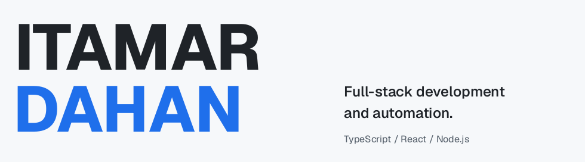
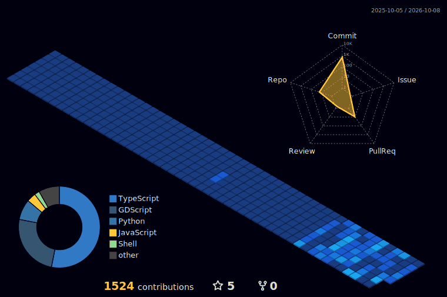
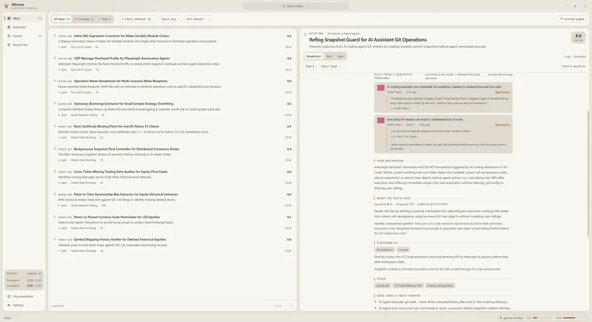

<picture>
  <source media="(prefers-color-scheme: dark)" srcset="assets/profile-v2/wordmark-dark.png" />
  
</picture>

[Website ↗](https://itamardahan.com/) &nbsp; [Selected work ↓](#selected-work) &nbsp; [Open source ↓](#open-source)

I’m a developer in Israel working across web apps, automation and desktop tools. My stack includes TypeScript, React, Node.js, C#/.NET and PostgreSQL.

## My GitHub activity

<picture>
  <source media="(prefers-reduced-motion: reduce)" srcset="assets/profile-v2/contributions-still.webp" />
  
</picture>

<sub>Real contribution data, refreshed daily. [View individual contributions ↗](https://github.com/DahanItamar?tab=overview)</sub>

## Selected work

### [Winnow ↗](https://github.com/DahanItamar/Winnow)

**Project ideas with an evidence trail.** A local-first desktop app that connects ideas to the developer complaints behind them. Electron, React and SQLite.

<a href="https://github.com/DahanItamar/Winnow"></a>

### [Slotline ↗](https://github.com/DahanItamar/Slotline)

**Two people book the same slot. Only one wins.** PostgreSQL exclusion constraints prevent overlapping bookings at write time. TypeScript, Fastify and PostgreSQL.

```sql
EXCLUDE USING gist (resource_id WITH =, period WITH &&)
WHERE (status = 'confirmed');
```

[Read the booking-race design ↗](https://github.com/DahanItamar/Slotline#slotline)

### [House Rules ↗](https://github.com/DahanItamar/HouseRules)

An offline Godot casino adventure with nine playable cabinets. An experiment in AI-assisted game development.

[Gameplay gallery ↗](https://github.com/DahanItamar/HouseRules#gallery)

## Open source

Two merged contributions to **mise**: [#13985](https://github.com/jdx/mise/pull/13985) and [#14034](https://github.com/jdx/mise/pull/14034).

[All merged contributions ↗](https://github.com/pulls?q=is%3Apr+author%3ADahanItamar+is%3Amerged)

<sub>3D data visualization by [github-profile-3d-contrib](https://github.com/yoshi389111/github-profile-3d-contrib). Project preview captured from Winnow itself.</sub>
