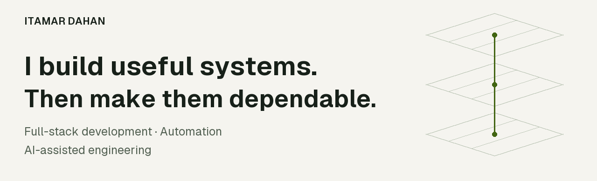
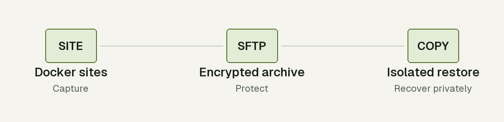
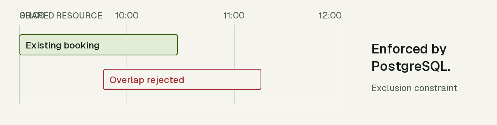
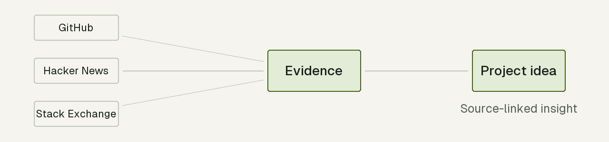
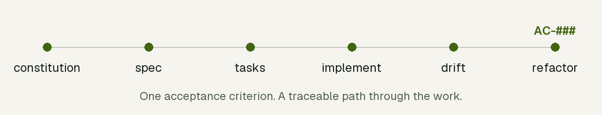

[← Back to the profile](README.md)

# Itamar Dahan

<picture>
  <source media="(max-width: 640px) and (prefers-color-scheme: dark)" srcset="assets/profile/hero-mobile-dark.png" />
  <source media="(max-width: 640px)" srcset="assets/profile/hero-mobile-light.png" />
  <source media="(prefers-color-scheme: dark)" srcset="assets/profile/hero-dark.png" />
  
</picture>

[Explore the systems](#selected-work) · [How I build](#skills-for-ai-coding-agents) · [Start a conversation](mailto:itamardahan1111d@gmail.com)

## About

I build applications end to end: server, data and interface. My work spans developer tooling, desktop software, scheduling systems, games and intelligent automation. I care about what happens after the first successful demo: readable architecture, secure defaults, accessible interfaces and a clear path to maintaining the system.

AI is part of both the engineering process and the products I build. I work with Claude Code, Codex and LLM-assisted workflows for architecture, implementation, review and testing; I also build automations with n8n and LLM APIs that connect services and turn repeated manual work into dependable processes.

## Selected Work

### DockNest

**Backups are only useful if recovery works.**

A self-hosted system for discovering Docker and static sites, scheduling backups, storing authenticated encrypted packages on SFTP, and restoring isolated private copies. Recovery evidence and an independently encrypted manager recovery kit are part of the design.

<samp>Private project · controlled beta · Node.js · SQLite · Docker · SFTP</samp>

<picture>
  <source media="(max-width: 640px) and (prefers-color-scheme: dark) and (prefers-reduced-motion: reduce)" srcset="assets/profile/docknest-mobile-dark.png" />
  <source media="(max-width: 640px) and (prefers-reduced-motion: reduce)" srcset="assets/profile/docknest-mobile-light.png" />
  <source media="(prefers-color-scheme: dark) and (prefers-reduced-motion: reduce)" srcset="assets/profile/docknest-dark.png" />
  <source media="(prefers-reduced-motion: reduce)" srcset="assets/profile/docknest-light.png" />
  <source media="(max-width: 640px) and (prefers-color-scheme: dark)" srcset="assets/profile/docknest-mobile-dark.png" />
  <source media="(max-width: 640px)" srcset="assets/profile/docknest-mobile-light.png" />
  <source media="(prefers-color-scheme: dark)" srcset="assets/profile/docknest-dark.png" />
  
</picture>

### [Slotline](https://github.com/DahanItamar/Slotline)

**One resource. One booking.**

A multi-tenant booking system for rooms, equipment and consultants. A PostgreSQL exclusion constraint prevents overlapping reservations at the database boundary. Row-level security isolates tenants; server-sent events keep calendars current.

<samp>TypeScript · Fastify · PostgreSQL</samp>

<picture>
  <source media="(max-width: 640px) and (prefers-color-scheme: dark) and (prefers-reduced-motion: reduce)" srcset="assets/profile/slotline-mobile-dark.png" />
  <source media="(max-width: 640px) and (prefers-reduced-motion: reduce)" srcset="assets/profile/slotline-mobile-light.png" />
  <source media="(prefers-color-scheme: dark) and (prefers-reduced-motion: reduce)" srcset="assets/profile/slotline-dark.png" />
  <source media="(prefers-reduced-motion: reduce)" srcset="assets/profile/slotline-light.png" />
  <source media="(max-width: 640px) and (prefers-color-scheme: dark)" srcset="assets/profile/slotline-mobile-dark.png" />
  <source media="(max-width: 640px)" srcset="assets/profile/slotline-mobile-light.png" />
  <source media="(prefers-color-scheme: dark)" srcset="assets/profile/slotline-dark.png" />
  
</picture>

### [Winnow](https://github.com/DahanItamar/Winnow)

**Ideas with evidence.**

A local-first desktop app that turns developer complaints from eight public sources into project ideas linked to the original threads. Semantic deduplication folds repeated complaints together while keeping their evidence.

<samp>TypeScript · Electron · React · SQLite</samp>

<picture>
  <source media="(max-width: 640px) and (prefers-color-scheme: dark) and (prefers-reduced-motion: reduce)" srcset="assets/profile/winnow-mobile-dark.png" />
  <source media="(max-width: 640px) and (prefers-reduced-motion: reduce)" srcset="assets/profile/winnow-mobile-light.png" />
  <source media="(prefers-color-scheme: dark) and (prefers-reduced-motion: reduce)" srcset="assets/profile/winnow-dark.png" />
  <source media="(prefers-reduced-motion: reduce)" srcset="assets/profile/winnow-light.png" />
  <source media="(max-width: 640px) and (prefers-color-scheme: dark)" srcset="assets/profile/winnow-mobile-dark.png" />
  <source media="(max-width: 640px)" srcset="assets/profile/winnow-mobile-light.png" />
  <source media="(prefers-color-scheme: dark)" srcset="assets/profile/winnow-dark.png" />
  
</picture>

<strong>Also built</strong> · games, live tools, web platforms and automation

 

| Project | What it does | Stack |
|:--|:--|:--|
| [**House Rules**](https://github.com/DahanItamar/HouseRules) | An offline casino adventure with nine playable cabinets and four connected rooms, built as a human-directed, AI-assisted game-development experiment. [Case study](https://houserules.itamardahan.com/). | <samp>Godot 4 · GDScript</samp> |
| [**GitCheckup**](https://github.com/DahanItamar/GitCheckup) | Scores public repositories across docs, community, activity, popularity and hygiene, with a ranked list of fixes. [Try it](https://gitcheckup.com). | <samp>TypeScript · Next.js</samp> |
| [**HeWordle**](https://github.com/DahanItamar/HeWordle) | Daily Hebrew Wordle with accounts, streaks and a leaderboard; zero npm dependencies and encrypted answers. [Play](https://wordlehebrew.com). | <samp>Node.js · SQLite</samp> |
| [**Meridian**](https://github.com/DahanItamar/meridian-landing) | A bilingual EN/HE landing page for a premium espresso grinder, with RTL support and a spec-driven accessibility process. [Visit](https://meridian.itamardahan.com/). | <samp>TypeScript · Next.js · Tailwind</samp> |
| [**Dealership Platform**](https://github.com/DahanItamar/dealership-platform) | A white-label bilingual car-dealership platform: showroom, financing, leads and an admin back office, with an in-memory demo mode. | <samp>TypeScript · TanStack · Supabase</samp> |
| [**Airport Simulator**](https://github.com/DahanItamar/AirportSimulator) | Real-time airport simulation with arrivals, departures and shared runway/gate queues, visible in a zero-dependency control-tower UI. | <samp>C# · ASP.NET Core · JS</samp> |
| [**ShortLinks**](https://github.com/DahanItamar/ShortLinks-Project) | URL shortener with Google sign-in, per-user analytics, ownership-guarded logs and cryptographically generated short codes. | <samp>C# · ASP.NET Core · EF Core</samp> |
| [**Warehouse Serial Scanner**](https://github.com/DahanItamar/warehouse-serial-scanner) | Touchscreen warehouse intake: barcode scanning, keypad checkout and pluggable SQL Server, MySQL or Postgres storage, plus a mock mode. | <samp>Node.js · Express</samp> |
| **Smart Data Matcher** | AI-powered spreadsheet normalization, LLM column mapping, value cleanup and rule-based filtering. | <samp>TypeScript · Gemini · Supabase</samp> |
| **Market News Engine** | An autonomous market-news pipeline producing and publishing posts, stories and short-form video across social platforms. | <samp>n8n · LLM APIs · Social APIs</samp> |
| **TeachersPlatform** | A Hebrew-first music-teacher marketplace with service listings, faceted search and escrow-protected payments. | <samp>TypeScript · Next.js · Prisma</samp> |
| **Shift Harmony** | Team shift planning and scheduling through a component-driven interface. | <samp>React · TypeScript · Cloudflare</samp> |
| **PulseOps** | A self-hosted real-time operations console for a single Docker engine. | <samp>TypeScript</samp> |

Entries without repository links are private projects.

## Skills for AI coding agents

**How I build: a requirement stays a requirement.**

I package engineering discipline into reusable skills, so the workflow carries the requirements instead of relying on memory. The spec chain follows the same acceptance criterion from definition through implementation, drift checks and refactoring.

<picture>
  <source media="(max-width: 640px) and (prefers-color-scheme: dark) and (prefers-reduced-motion: reduce)" srcset="assets/profile/process-mobile-dark.png" />
  <source media="(max-width: 640px) and (prefers-reduced-motion: reduce)" srcset="assets/profile/process-mobile-light.png" />
  <source media="(prefers-color-scheme: dark) and (prefers-reduced-motion: reduce)" srcset="assets/profile/process-dark.png" />
  <source media="(prefers-reduced-motion: reduce)" srcset="assets/profile/process-light.png" />
  <source media="(max-width: 640px) and (prefers-color-scheme: dark)" srcset="assets/profile/process-mobile-dark.png" />
  <source media="(max-width: 640px)" srcset="assets/profile/process-mobile-light.png" />
  <source media="(prefers-color-scheme: dark)" srcset="assets/profile/process-dark.png" />
  
</picture>

- [**spec-architect**](https://github.com/DahanItamar/spec-architect) — six stages with stable acceptance criteria, cited and verified throughout the work.
- [**readme-architect**](https://github.com/DahanItamar/readme-architect) — documentation built from running the project and observing its actual behavior.
- [**uilint**](https://github.com/DahanItamar/uilint) — checks loading, empty, error, success and partial UI states, including the cases that cause silent user harm.
- [**acsm**](https://github.com/DahanItamar/acsm) — routes projects to the security and compliance obligations that apply, with citations carried into the audit.

<strong>Engineering principles and stack</strong>

 

- **Architecture first:** small classes, clear layers and code that explains itself.
- **Fewer dependencies:** fewer moving parts and a smaller maintenance surface.
- **Security by default:** encryption at rest, proper password hashing and secrets kept out of Git.
- **Accessible interfaces:** keyboard and screen-reader support, with WCAG guiding implementation.

**Core:** JavaScript · TypeScript · React · Node.js · C# · .NET · PostgreSQL · SQLite · Docker

**AI and automation:** Claude Code · Codex · n8n · LLM APIs · agent workflows

---

**Explore the work. Start a conversation.**

[itamardahan1111d@gmail.com](mailto:itamardahan1111d@gmail.com)

Profile options

[View with motion](README.md) · [Previous README](archive/README-2026-10-06-before-redesign.md) · [Restore instructions](RESTORE.md)

